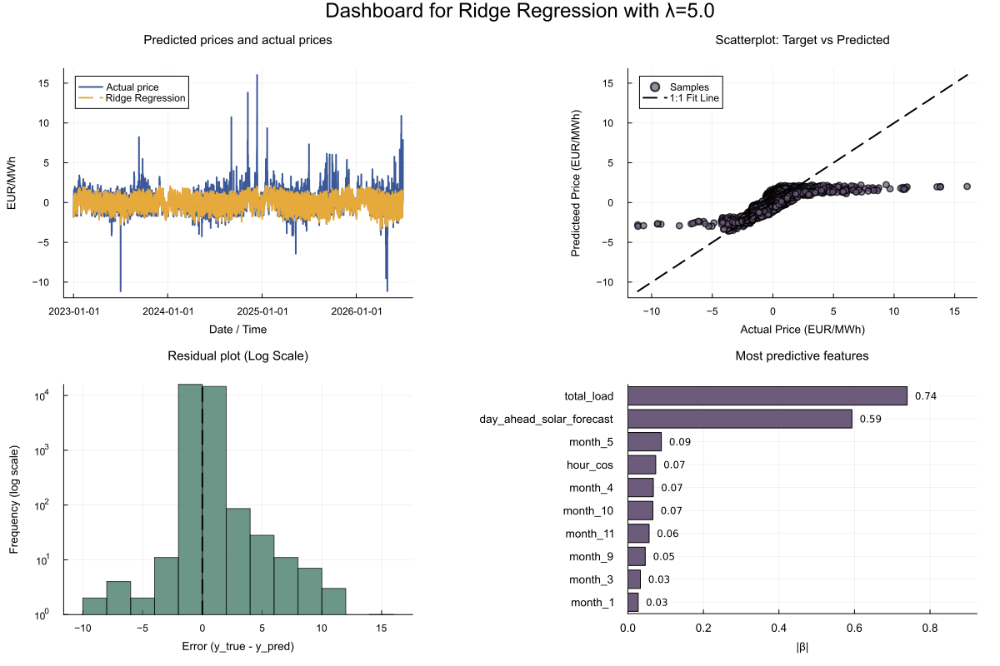
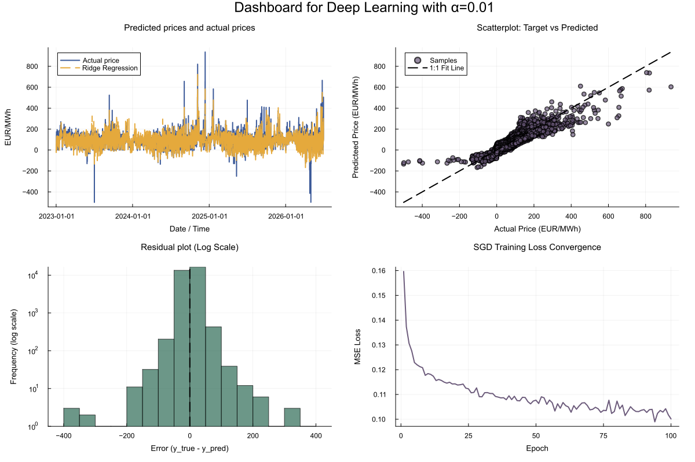

# ⚡ Day-Ahead Electricity Price Forecasting (in Julia)

Quantitative modeling pipeline to forecast Day-Ahead electricity prices using **Julia**. This repository compares a classical regularized linear baseline (Ridge Regression) against a multi-layer Neural Network trained on fundamental market features.

 

------------------------------------------------------------------------

## 📌 Key Highlights

- **Domain & Data:** Automated ingestion of European power market data via the **ENTSO-E Transparency Platform API** (with local dummy data fallback for testing).
- **Feature Engineering:** Periodic/cyclical transformation of temporal features (e.g., sine/cosine encoding for hour-of-day dynamics) to capture intraday seasonalities.
- **Model Comparison:** Benchmarking a closed-form multivariate Ridge Regression baseline against a custom Deep Learning approach.

------------------------------------------------------------------------

## 📊 Models & Methodology

### 1. Ridge Regression (Linear Baseline)

A classical multivariate linear model solved directly via the pseudoinverse with $L_2$ regularization. This serves as a baseline to demonstrate the non-linear complexities inherent to power market prices:

### 2. Deep Learning Architecture

A dense neural network architecture designed to capture non-linear market dynamics, following the book "Grokking Deep Learning". Key features:\
\* **Activation:** ReLU functions for non-linear mappings.\
\* **Optimization:** Stochastic Gradient Descent (SGD) on normalized feature vectors.\
\* **Performance:** Significantly outperforms the linear baseline on test sets.\

------------------------------------------------------------------------

## 🚀 How to Run & Use

### 1) Data Retrieval & Preprocessing

Navigate to the `data/` directory: \* Run `data.ipynb` to fetch historical market data via the ENTSO-E API (*requires API key*). \* Alternatively, run `create_dummy_csv.py` to generate synthetic market data for offline development.

*Both methods clean, scale, and format temporal features into periodic representations tailored for deep learning inputs.*

### 2) Model Execution & Dashboard

Once the dataset is prepared, run the main Julia script: \`\`\`bash julia energy_price_predictions.jl
