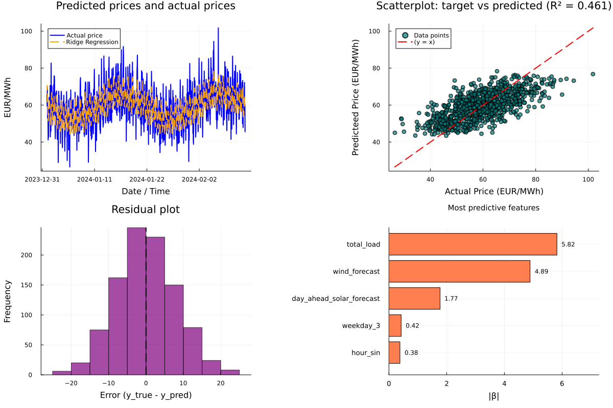

# energy-price-predictions
Predicting the day ahead price of energy using techniques from linear algebra and maschine learning

## 1) Get the data
Running *create_dummy_csv.py* creates a .csv file with fake data. The goal is to replace this by ENTSEO data once I have my API key. The script also formats the data accordingly, for example it converts hours into a periodic format that can be exploited by deep learning algorithms.

## 2) Analyze the data
Once the .csv exists, running *price_predictions.jl* does a ridge regression, shows the coefficients and makes a dashboard of useful plots.

