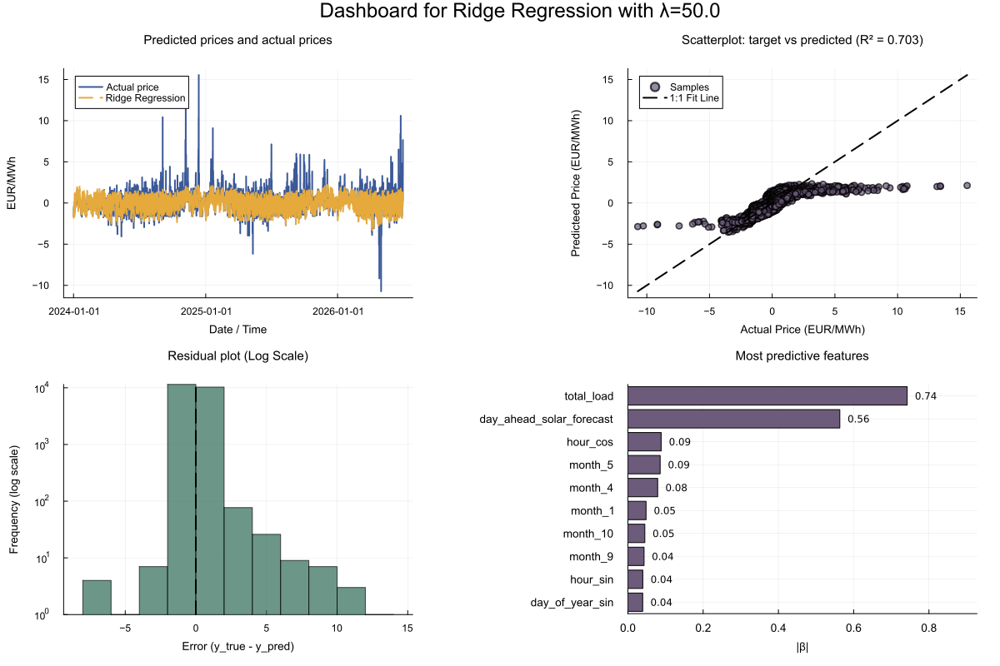
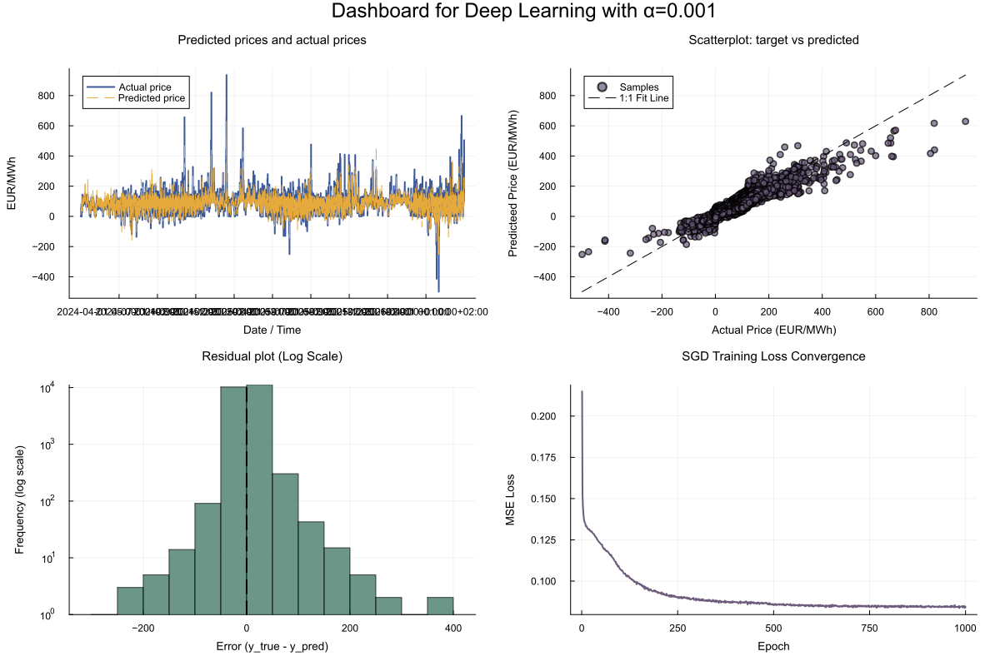

# energy-price-predictions
Predicting the day ahead price of energy using techniques from linear algebra and maschine learning

## 1) Get the data
In the data directory, running the notebook *data.ipynb* pulls real power data. Note that you need an ENTSOE API key for this. Alternatively, run  *create_dummy_csv.py* to create a .csv file with fake data. Both ways format the data accordingly, for example converting hours into a periodic format that can be exploited by deep learning algorithms.

## 2) Analyze the data
Once the .csv exists, there are two approaches to analyze the data and make preditions. In *ridge_regression_prediction.jl*, a classical ridge regression is used. In *deep_leanring_prediction.jl*, we use a simple neural network with RELU and Stochastic Gradient Descent. Both scripts build dashboards that can be used to view some of the model's properties.

